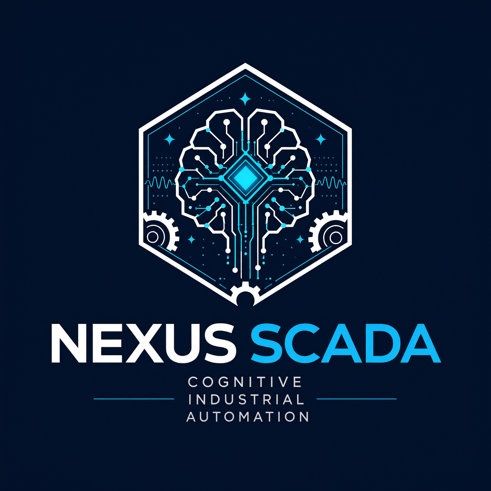

<div align="center">

  <!-- LOGO SECTION -->
  

  # ⚡ NEXUS SCADA
  
  ### **Cognitive Industrial Automation Platform**

  *Bridging Deterministic Layer-2 Control with Local LLM Intelligence.*

  <br/>

  
  
  
  
  
  
  
  
  

  <br/>

  [🏗️ Architecture](#-system-architecture) • 
  [🧠 Cognitive Agent](#-cognitive-context-enrichment) • 
  [📡 Register Map](#-modbus-register-map) • 
  [🚀 Deployment](#-deployment) • 
  [👥 Team](#-the-team-behind-nexus)

</div>

---

## 🎯 Executive Summary

**NEXUS SCADA** is an enterprise-level industrial monitoring and supervision platform designed to mirror automotive manufacturing environments. It uniquely bridges the gap between deterministic **Layer 2 control** (PLC/HMI) and **Layer 4 cognitive analytics**.

Unlike traditional SCADA systems that rely on static thresholds and blind alarms, NEXUS employs a local Large Language Model (**Qwen2.5-Coder**) enriched with 24-hour statistical telemetry and an Obsidian-backed knowledge vault. This allows the system to:
*   Diagnose complex electrical anomalies.
*   Distinguish transient spikes from sustained degradation ("Doctor-with-History").
*   Auto-generate interlinked incident reports for shift engineers.

The result is a **fail-safe, observable, and intelligent** automation stack that runs entirely offline/on-premise.

---

## 🏗️ System Architecture

The system enforces a strict **Single Source of Truth** topology. The PLC simulator acts as the authoritative state machine, while the FastAPI backend, Streamlit dashboard, and Tkinter HMI operate as concurrent, stateless observers and command issuers.

```text
┌────────────────────────────────────────────────────────────────────┐
│                   Delta PLC Simulator (Python)                     │
│   6 Equipment × 18 Registers + HR[120] System Status Word          │
│   ANSI Protection Layer (49/50/51/27/59/38) + E-STOP Latching      │
└──────────────────────────────┬─────────────────────────────────────┘
                               │ Modbus TCP (Port 5020)
                               ▼
┌────────────────────────────────────────────────────────────────────┐
│                   FastAPI Backend (Uvicorn)                        │
│   ┌──────────────┐   ┌────────────────┐   ┌────────────────────┐  │
│   │ SQLite (WAL) │   │ TTL API Cache  │   │ Industrial Agent   │  │
│   └──────────────┘   └────────────────┘   └─────────┬──────────┘  │
└──────────────────────────────────────────────────────┼─────────────┘
           │                                           │
           ▼                                           ▼
┌──────────────────────┐                    ┌──────────────────────┐
│ Streamlit Dashboard  │                    │ Local LLM Engine     │
│ (Layer 4 Analytics)  │                    │ (Qwen2.5-Coder 1.5B) │
└──────────────────────┘                    └──────────┬───────────┘
                                                       │
                                                       ▼
                                            ┌──────────────────────┐
                                            │ Obsidian Knowledge   │
                                            │ Vault (Incidents/)   │
                                            └──────────────────────┘
```

---

## 🧠 Cognitive Context Enrichment

The core innovation of NEXUS is the **Cognitive Twin** paradigm. The LLM is never load-bearing for safety; it is strictly additive for diagnosis.

### 1. The "Doctor-with-History" Paradigm
Before invoking the LLM, the backend computes SQL-side 24-hour statistical aggregates (current mean/sigma, thermal capacity trends, alarm frequency). This context is injected into the prompt, allowing the model to distinguish a momentary voltage sag from a sustained feeder degradation.

### 2. Obsidian Knowledge Vault
High-severity diagnoses (Safety Level ≥ 3) automatically trigger the `obsidian_bridge`. The system generates interlinked Markdown incident reports (e.g., `[[STP-01]]` ↔ `[[ANSI-49-Thermal]]`), creating a self-updating, file-based knowledge graph that shift engineers can navigate natively in Obsidian.

### 3. Fail-Safe AI
A canary guard rejects LLM prompt-echoes, and the vault bridge is fire-and-forget. If the AI or file I/O fails, the deterministic rule engine and Modbus safety loops continue operating without interruption.

---

## 🛡️ Deterministic Safety & ANSI Protection

The simulator implements a rigorous protection layer independent of the AI:

*   **ANSI Relays**: Thermal Overload (49), Instantaneous OC (50), Time OC (51), Undervoltage (27), Overvoltage (59), Over-Temperature (38).
*   **Global E-STOP**: Coil `CO[6]` latches globally. The `SafeSlaveContext` intercepts writes synchronously, measured end-to-end at 115 ms (docs/evidence/estop_latency.txt), with no polling loop in the path.
*   **Idempotent Fault Recovery**: E-STOP and RESET commands are idempotent, preventing console flood and state corruption during rapid HMI interactions.

---

## 📡 Modbus Register Map

Each of the 6 equipment nodes exposes **18 Holding Registers**. 

| Offset | Description | Unit/Scale | Type |
| :--- | :--- | :--- | :--- |
| `+0` | Voltage | V × 10 | Input |
| `+1` | Current | A × 10 | Input |
| `+2` | Active Power | kW × 10 | Input |
| `+3` | Reactive Power | kVAR × 10 | Input |
| `+4` | Apparent Power | kVA × 10 | Input |
| `+5` | Power Factor | pf × 100 | Input |
| `+6` | Frequency | Hz × 10 | Input |
| `+7` | Energy | kWh × 100 | Input |
| `+8` | Motor State | 0=STOP, 1=RUN, 2=PENDING, 3=LOCKOUT | Status |
| `+9` | Alarm Flag | Boolean (1=Active) | Status |
| `+10` | Trip Word | ANSI Fault Bitmask (Bits 0-5) | Status |
| `+11` | Running Time | Minutes | Input |
| `+12` | Load | % (0-100) | I/O |
| `+13` | Alarm Word | Warning Bitmask (Bits 6-7) | Status |
| `+14` | Lockout Status | 1=Latched, 0=Clear | Status |
| `+15` | Thermal Cap. (θ) | ‰ (× 1000) | Status |
| `+16` | Trip Count | Cumulative | Status |
| `+17` | Heartbeat | 0-65535 (Watchdog) | Status |

**System Status Word (`HR[120]`)**:
*   `Bit 0`: Global E-STOP Latched
*   `Bit 1`: Any Equipment Tripped

---

## 🛠️ Tech Stack

*   **Backend & API**: FastAPI, Uvicorn, SQLite (WAL mode, partial indexing), PyModbus 3.6.9
*   **Cognitive Engine**: `llama-cpp-python`, Qwen2.5-Coder-1.5B-Instruct (GGUF, CPU-optimized)
*   **Frontend / HMI**: Streamlit 1.64.0, Tkinter (Native), Plotly 7.1.0
*   **Data & Analytics**: Pandas 3.0.6, NumPy 2.4.6

---

## 🚀 Deployment

### Prerequisites
*   Python 3.11+
*   Git

### Quick Start (Windows)
Execute the production orchestrator to launch the PLC, Backend, HMI, and Dashboard concurrently:
```bash
run_all.bat
```

### Manual Execution
```bash
# 1. PLC Simulator
python plc_simulator/modbus_server.py

# 2. FastAPI Backend
uvicorn backend.api:app --host 127.0.0.1 --port 8000

# 3. Streamlit Dashboard
streamlit run dashboard/streamlit_app.py --server.port 8501
```

---

## 📥 Model Setup (One-Time Download, ~1.4 GB)

The LLM weights are intentionally not included in this repository. GitHub enforces a hard limit of 100 MB per file, and large binary artifacts do not belong in git history. You must download the model once before running the cognitive agent:

```bash
curl -L -o models/qwen2.5-coder-1.5b-instruct-q6_k.gguf \
  https://huggingface.co/Qwen/Qwen2.5-Coder-1.5B-Instruct-GGUF/resolve/main/qwen2.5-coder-1.5b-instruct-q6_k.gguf
```

**Alternative via Hugging Face CLI:**
```bash
pip install huggingface_hub
huggingface-cli download Qwen/Qwen2.5-Coder-1.5B-Instruct-GGUF \
  qwen2.5-coder-1.5b-instruct-q6_k.gguf --local-dir models
```

> **Note:** Until this file exists at `models/qwen2.5-coder-1.5b-instruct-q6_k.gguf`, `tests/quick_test.py` will report the model as missing. This is by design: the verifier explicitly tells you what a fresh clone still needs to be fully operational.

---

## 📓 Engineering Notes

*   **Schema Drift Control**: The backend reads DDL directly from `sqlite_master` at runtime rather than relying on hardcoded ORM assumptions. This prevents silent data corruption and ensures fresh clones initialize correctly regardless of migration history.
*   **SQL-Side Aggregation**: 24-hour statistical context is computed using `AVG()`, `MAX()`, and $E[X^2] - (E[X])^2$ variance directly in SQLite's C layer, reducing Python memory overhead from ~20k rows to a single tuple per equipment.
*   **Audit Integrity**: Both the deterministic rule engine and the LLM reasoner write to tamper-evident JSONL audit trails, ensuring every automated action and diagnosis is traceable for IEC 62443 compliance postures.

---

## 👥 The Team Behind NEXUS

This project represents an interdisciplinary fusion of **Industrial Electronics**, **Cognitive Science**, and **Data Operations**. It was built collaboratively by three specialists aiming to bridge the gap between Industry 4.0 automation and Industry 5.0 human-centric cognition.

<table>
  <tr>
    <td align="center"><strong>🔌 Hardware & Electrical Standards</strong></td>
    <td align="center"><strong>🧠 Cognitive Architecture & ML</strong></td>
    <td align="center"><strong>💻 Data Ops & Integration Lead</strong></td>
  </tr>
  <tr>
    <td align="center">
      <a href="https://www.linkedin.com/in/peiman-kheiran-3a8211231/">
        <strong>Peiman Kheiran</strong>
      </a><br/>
      <em>PhD Student, Electronics<br/>University of Windsor, Canada</em><br/><br/>
      Architected the secure protocol-level communication bridge between SCADA and PLCs, ensuring full compliance with modern industrial standards and embedded system stability.
    </td>
    <td align="center">
      <a href="https://www.linkedin.com/in/atefeh-nouri-b32a7324a/">
        <strong>Atefeh Nouri</strong>
      </a><br/>
      <em>MSc Student, Neurocognitive Psychology<br/>University of Oldenburg, Germany</em><br/><br/>
      Designed the "mental framework" using Obsidian Knowledge Graphs and aligned local AI inference with cognitive flexibility paradigms for historical data learning.
    </td>
    <td align="center">
      <a href="https://www.linkedin.com/in/reza-esmaeili-mood-990237273/">
        <strong>Reza Esmaeili Mood</strong>
      </a><br/>
      <em>Industrial Data Analyst<br/>Project Lead & DevOps</em><br/><br/>
      Led the integration of OT/IT pipelines, managed the DataOps infrastructure, and deployed the open-source architecture connecting all layers.
    </td>
  </tr>
</table>

<br/>

<div align="center">
  
  > *"Can industrial machines possess human-like 'cognitive understanding'? We believe the answer lies in the collaboration of human cognition and machine execution."*

  <br/>
  
  **Architected for reliability, observability, and cognitive supervision.**
  
  <i>MIT License © 2026 Nexus SCADA Team</i>

</div>
```