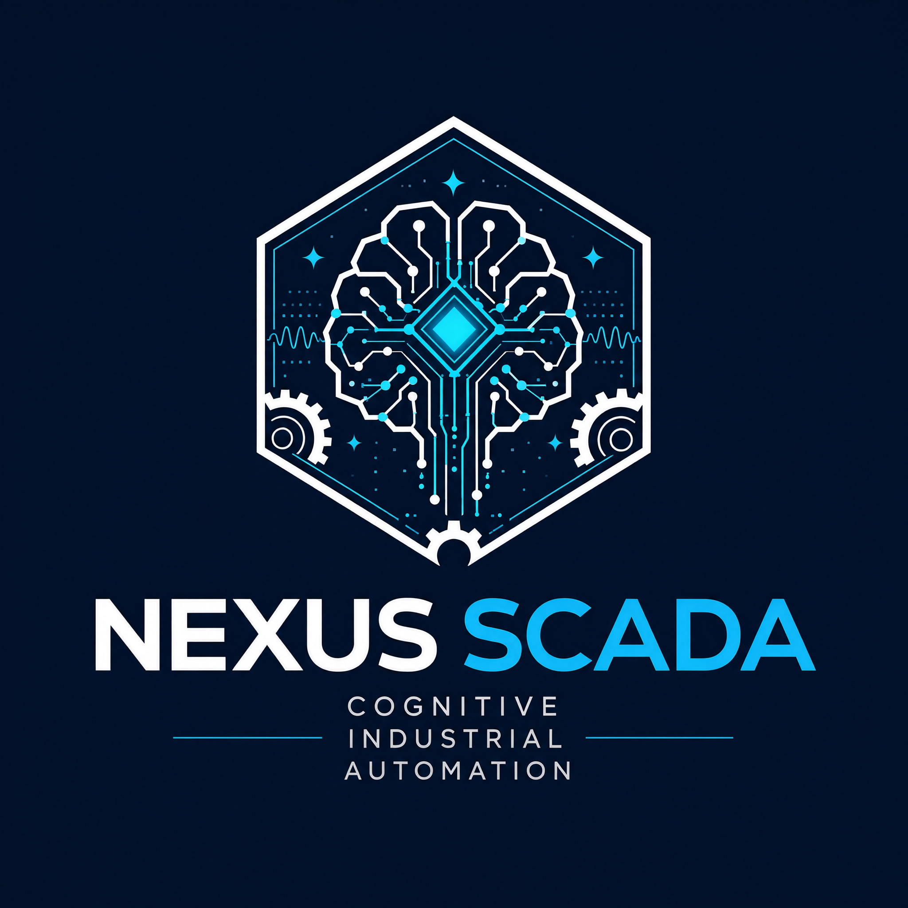
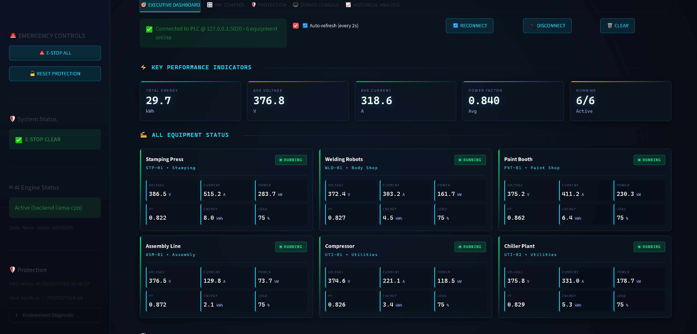
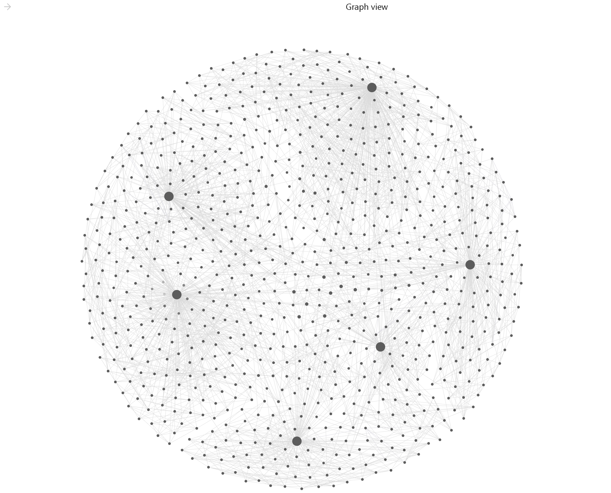

<div align="center">

  <!-- LOGO SECTION -->
  

  # ⚡ NEXUS SCADA

  ### **Cognitive Industrial Automation Platform**

  *A research prototype and reference architecture bridging deterministic Layer-2 control with local LLM intelligence.*

  <br/>

  
  
  
  
  
  
  
  
  
  

  <br/>

  [🏗️ Architecture](#architecture) •
  [🧠 Cognitive Agent](#cognitive) •
  [📡 Register Map](#register-map) •
  [📦 Setup](#setup) •
  [✅ Verification](#verification) •
  [🖼️ Demo](#visuals) •
  [⚠️ Limitations](#limitations) •
  [🚀 Deployment](#deployment) •
  [👥 Team](#team)

</div>

---

<a id="overview"></a>
## 🎯 Executive Summary

**NEXUS SCADA** is a **research prototype and reference architecture** for cognitive industrial automation. It explores how deterministic Layer-2 SCADA control can be augmented with local cognitive diagnosis **without placing AI inside the safety loop**.

The system mirrors an automotive manufacturing environment using:

- a simulated PLC ecosystem,
- an ANSI-inspired protection layer,
- Modbus TCP telemetry,
- a FastAPI backend,
- SQLite WAL storage,
- a Streamlit dashboard,
- a Tkinter HMI,
- and a local **Qwen2.5-Coder** cognitive agent.

Unlike traditional SCADA alarm systems that only report threshold violations, NEXUS attempts to provide contextual diagnosis by combining:

- deterministic rule-based protection,
- 24-hour statistical telemetry context,
- local LLM reasoning,
- Obsidian-linked incident knowledge.

The result is a **fail-safe, observable, locally executable automation prototype**.

> **Important positioning statement:**  
> NEXUS SCADA is not presented as a certified industrial product. It is a research prototype and reference architecture for exploring the boundary between deterministic industrial control and cognitive diagnosis.

---

<a id="architecture"></a>
## 🏗️ System Architecture

The system enforces a strict **Single Source of Truth** topology. The PLC simulator acts as the authoritative state machine, while the FastAPI backend, Streamlit dashboard, and Tkinter HMI operate as concurrent observers and command issuers.

```text
┌────────────────────────────────────────────────────────────────────┐
│                     PLC Simulator (Python)                         │
│   6 Equipment × 18 Registers + HR[120] System Status Word          │
│   ANSI-inspired Protection Layer                                   │
│   (49/50/51/27/59/38/46/37) + E-STOP Latching                      │
└──────────────────────────────┬─────────────────────────────────────┘
                               │ Modbus TCP (Port 5020)
                               ▼
┌────────────────────────────────────────────────────────────────────┐
│                     FastAPI Backend (Uvicorn)                      │
│   ┌──────────────┐   ┌────────────────   ┌────────────────────  │
│   │ SQLite (WAL) │   │ TTL API Cache  │   │ Industrial Agent   │  │
│   └──────────────┘   └────────────────┘   └─────────┬──────────┘  │
└──────────────────────────────────────────────────────┼─────────────┘
           │                                           │
           ▼                                           ▼
┌──────────────────────┐                    ┌──────────────────────┐
│ Streamlit Dashboard  │                    │ Local LLM Engine     │
│ (Layer 4 Analytics)  │                    │ (Qwen2.5-Coder 1.5B) │
└──────────────────────┘                    └──────────┬───────────┘
                                                       │
                                                       ▼
                                            ┌──────────────────────┐
                                            │ Obsidian Knowledge   │
                                            │ Vault (Incidents/)   │
                                            └──────────────────────┘
```

### Architectural Principles

- **Deterministic control remains independent of AI.**
- **The LLM is diagnostic only and never actuates safety-critical control.**
- **SQLite WAL is used as a lightweight embedded telemetry store.**
- **Obsidian is used as a local Markdown knowledge vault, not as a control-plane database.**
- **Auditability is treated as a first-class engineering requirement.**

---

<a id="cognitive"></a>
## 🧠 Cognitive Context Enrichment

The core idea of NEXUS is the **Cognitive Twin** paradigm. The LLM is never load-bearing for safety; it is strictly additive for diagnosis.

### 1. The “Doctor-with-History” Paradigm

Before invoking the LLM, the backend computes SQL-side 24-hour statistical aggregates such as:

- current mean,
- current sigma,
- thermal capacity trends,
- alarm frequency,
- drift indicators.

This context is injected into the prompt, allowing the model to distinguish:

- a momentary voltage sag,
- from a sustained feeder degradation,
- from a transient startup spike,
- from a true ANSI protection event.

### 2. Obsidian Knowledge Vault

High-severity diagnoses automatically trigger the `obsidian_bridge`.

The system generates interlinked Markdown incident reports, for example:

```text
[[STP-01]] ↔ [[ANSI-49-Thermal]] ↔ [[Feeder-Degradation-Log]]
```

This creates a self-updating, file-based knowledge graph that engineers can navigate natively in Obsidian.

### 3. Fail-Safe AI Design

The cognitive layer is intentionally non-critical:

- a canary guard rejects LLM prompt echoes,
- the vault bridge is fire-and-forget,
- if the LLM or file I/O fails, the deterministic rule engine and Modbus safety loops continue operating.

This separation is central to the architecture.

---

<a id="safety"></a>
## 🛡️ Deterministic Safety & ANSI-Inspired Protection

The simulator implements a protection layer independent of the AI.

### ANSI-Inspired Relay Coverage

The current protection model references the following ANSI device numbers:

| ANSI Code | Function |
| ---: | --- |
| `27` | Undervoltage |
| `37` | Undercurrent / auxiliary undervoltage logic |
| `38` | Over-temperature / thermal condition |
| `46` | Voltage restraint |
| `49` | Thermal overload |
| `50` | Instantaneous overcurrent |
| `51` | Time overcurrent |
| `59` | Overvoltage |

### Global E-STOP Behavior

- Coil `CO[6]` latches globally.
- The `SafeSlaveContext` intercepts writes synchronously.
- Measured end-to-end latency is documented in:

```text
docs/evidence/estop_latency.txt
```

- The current measured value is approximately **115 ms** in the simulator/backend path.

> This latency figure is an engineering evidence artifact for the prototype path. It is **not** a safety-certification claim.

### Idempotent Fault Recovery

E-STOP and RESET commands are idempotent, preventing:

- console flood,
- duplicate audit events,
- state corruption during rapid HMI interactions.

---

<a id="register-map"></a>
## 📡 Modbus Register Map

Each of the 6 equipment nodes exposes **18 Holding Registers**.

| Offset | Description | Unit / Scale | Type |
| ---: | --- | --- | --- |
| `+0` | Voltage | V × 10 | Input |
| `+1` | Current | A × 10 | Input |
| `+2` | Active Power | kW × 10 | Input |
| `+3` | Reactive Power | kVAR × 10 | Input |
| `+4` | Apparent Power | kVA × 10 | Input |
| `+5` | Power Factor | pf × 100 | Input |
| `+6` | Frequency | Hz × 10 | Input |
| `+7` | Energy | kWh × 100 | Input |
| `+8` | Motor State | 0=STOP, 1=RUN, 2=PENDING, 3=LOCKOUT | Status |
| `+9` | Alarm Flag | Boolean, 1=Active | Status |
| `+10` | Trip Word | ANSI fault bitmask | Status |
| `+11` | Running Time | Minutes | Input |
| `+12` | Load | %, 0–100 | I/O |
| `+13` | Alarm Word | Warning bitmask | Status |
| `+14` | Lockout Status | 1=Latched, 0=Clear | Status |
| `+15` | Thermal Capacity θ | ‰ × 1000 | Status |
| `+16` | Trip Count | Cumulative | Status |
| `+17` | Heartbeat | 0–65535 watchdog | Status |

### System and Auxiliary Registers

| Register | Description |
| --- | --- |
| `HR[120]` | System status word |
| `HR[150]` | Fault injection map, used by live verifier |
| `HR[160-165]` | Operator load setpoints with PLC ramp and audit trail |

**System Status Word, `HR[120]`:**

| Bit | Meaning |
| ---: | --- |
| `0` | Global E-STOP latched |
| `1` | Any equipment tripped |

---

<a id="tech-stack"></a>
## 🛠️ Tech Stack

### Backend & API

- FastAPI
- Uvicorn
- SQLite, WAL mode
- PyModbus 3.6.9

### Cognitive Engine

- `llama-cpp-python`
- Qwen2.5-Coder-1.5B-Instruct
- GGUF quantized model, CPU-optimized

### Frontend / HMI

- Streamlit
- Tkinter native HMI
- Plotly analytics

### Data & Analytics

- Pandas
- NumPy

### Knowledge Vault

- Obsidian-compatible Markdown
- `[[wiki-links]]`
- local file-based incident graph

---

<a id="setup"></a>
## 📦 Setup & Dependencies

NEXUS SCADA follows a **code-light repository model**:

- source code lives in Git,
- large binary assets such as LLM weights are downloaded separately,
- third-party desktop applications such as Obsidian are installed from official sources.

This keeps the repository fast to clone and compliant with GitHub file-size limits.

---

### 1. Python Environment

Create and activate a virtual environment:

```bash
python -m venv .venv
```

Activate it:

```bash
# Windows PowerShell
.venv\Scripts\Activate.ps1
```

```bash
# Windows CMD
.venv\Scripts\activate.bat
```

```bash
# macOS / Linux
source .venv/bin/activate
```

Install dependencies:

```bash
pip install -r requirements.txt
```

> If `llama-cpp-python` requires a platform-specific wheel, follow the installation note in `requirements.txt`.

---

### 2. Local LLM Model Download

The cognitive agent uses **Qwen2.5-Coder-1.5B-Instruct** quantized as **Q6_K GGUF**.

- Approximate size: **~1.4 GB**
- Required path:

```text
models/qwen2.5-coder-1.5b-instruct-q6_k.gguf
```

GitHub enforces a hard limit of 100 MB per file, and large binary artifacts should not be stored in Git history. Therefore, the model must be downloaded separately.

#### Option A: Direct Download, Bash / Git Bash / Linux / macOS

```bash
mkdir -p models

curl -L -o models/qwen2.5-coder-1.5b-instruct-q6_k.gguf \
  https://huggingface.co/Qwen/Qwen2.5-Coder-1.5B-Instruct-GGUF/resolve/main/qwen2.5-coder-1.5b-instruct-q6_k.gguf
```

#### Option B: Direct Download, Windows PowerShell

```powershell
New-Item -ItemType Directory -Force -Path models | Out-Null

Invoke-WebRequest `
  -Uri "https://huggingface.co/Qwen/Qwen2.5-Coder-1.5B-Instruct-GGUF/resolve/main/qwen2.5-coder-1.5b-instruct-q6_k.gguf" `
  -OutFile "models\qwen2.5-coder-1.5b-instruct-q6_k.gguf"
```

#### Option C: Hugging Face CLI

```bash
pip install huggingface_hub

huggingface-cli download Qwen/Qwen2.5-Coder-1.5B-Instruct-GGUF \
  qwen2.5-coder-1.5b-instruct-q6_k.gguf \
  --local-dir models
```

Verify that the file exists:

```text
models/qwen2.5-coder-1.5b-instruct-q6_k.gguf
```

> Until this file exists, `tests/quick_test.py` will report the model as missing. This is intentional: the verifier tells you exactly what a fresh clone still needs before the cognitive agent can run.

---

### 3. Obsidian Knowledge Vault Setup

Obsidian is used to view the auto-generated incident vault located at:

```text
data/scada_vault/
```

The backend writes Markdown incident files directly into this folder.

Obsidian is **not required for the SCADA system to run**, but it is strongly recommended for engineers who want to explore:

- incident history,
- wiki-links,
- machine-to-standard relationships,
- root-cause graphs,
- knowledge continuity across shifts.

#### Installation Steps

1. Download Obsidian from the official website:

   [https://obsidian.md/download](https://obsidian.md/download)

2. Install the desktop application for your operating system.

3. Open Obsidian.

4. Select:

   ```text
   Open another vault → Open folder as vault
   ```

5. Navigate to your project folder and select:

   ```text
   Car-Factory-Electrical-Data/data/scada_vault
   ```

6. Open the vault.

Inside Obsidian, you can use:

- **Graph View** to see connections between machines, ANSI standards, faults, and incidents.
- **Backlinks** to trace every incident related to a specific equipment node.
- **Search** to find historical diagnostics across all Markdown reports.
- **Wiki-links** such as:

```text
[[STP-01]]
[[ANSI-49-Thermal]]
[[Feeder-Degradation-Log]]
```

> Obsidian is free for personal use. Do not bundle the Obsidian installer inside this repository. Always download it from the official source.

---

<a id="verification"></a>
## ✅ Verification & Evidence

NEXUS SCADA includes a **behavioral verification suite** (`tests/quick_test.py`) that exercises the full cognitive-industrial chain, not just structural presence.

### Current verified status (2026-10-06)

The following status was produced by `tests/quick_test.py --live --json` and is backed by a machine-readable artifact under `docs/evidence/`:

```
PASS: 139   WARN: 2   FAIL: 0
VERDICT: SYSTEM HEALTHY - safe to proceed
```

| Layer | Status | Evidence |
|-------|--------|----------|
| Deterministic safety layer | **100%** of live probes pass | E-STOP exactly-once, HR[120] bit0 latch/unlatch, ANSI trip latching, idempotent recovery, block restart |
| Cognitive triad (fault → rule engine → LLM → Obsidian) | **6/6 devices** complete | One chain per equipment node, each producing a distinct diagnosis and a `[[wiki-link]]`-rich incident note |
| Statistical memory persistence | **PASS** | `alarm_events` populated per sweep (+33 rows) |
| Audit hash-chain integrity | **PASS** | 2581 records, linkage intact |
| Autonomous remediation (Option A semantics) | **PASS** | `REMEDIATION_DECISION` emitted; actuation withheld because the rule engine marks protective trips as `auto_allowed=False` |
| Episodic-memory probe | **WARN** | Dedup limit; see [Known Limitations → Verification backlog](#limitations) |
| Obsidian remediation-section discovery | **WARN** | Async write race; see [Known Limitations → Verification backlog](#limitations) |

### Verification history — from 6 WARNs to 2 WARNs

The verifier has been tightened during development. An earlier run on 2026-10-06 produced **137 PASS / 6 WARN / 0 FAIL**. Four of those six WARNs turned out to be **observability defects in the verifier itself**, not real system failures. The following table records exactly what was wrong and what was changed:

| Original WARN | Root cause | Resolution |
|---------------|-----------|------------|
| `Streamlit :8501 not running` | Cosmetic — the UI process was not launched before the verifier ran | Streamlit is now started as part of the standard verification sweep |
| `REMEDIATION_DECISION emitted — timeout within 180s` | Verifier window (180 s) was **shorter than observed chain latency** (~206 s on this CPU: rule-engine cadence + LLM reasoner + cognition tick) | Verifier timeout extended to **300 s** to match observed latency; the audit log already proved the chain fired correctly |
| `AUTO_REMEDIATION_EXECUTED observed — timeout within 180s` | Downstream of the same 180 s window | Same fix (300 s) |
| `load setpoint reduced autonomously — baseline=80, new=80` | Verifier recorded the check **before** the `policy_withheld` flag could be set; the withhold is intentional (Option A) | Check rewritten as an explicit `if policy_withheld: PASS else: <measurement>` branch |
| `Obsidian incident contains Autonomous Remediation — not found` | **Still tracked.** Async write race; see [Known Limitations](#limitations) | Not yet fixed |
| `prior_incidents field absent` | **Still tracked.** Episodic-memory prompt injection is a real feature gap; see [Known Limitations](#limitations) | Not yet fixed |

**Key insight:** the deterministic safety layer and the cognitive triad were **already passing** in the 137/6/0 run. The four WARNs that changed to PASS were verifier-observability mismatches, not system regressions. The two remaining WARNs are genuine, documented backlog items.

### What the verifier checks

- Backend / API availability
- SQLite telemetry freshness (last-write < 15 s)
- Hash-chained JSONL audit integrity
- Obsidian vault structure and writability
- PLC audit correlation for each injection
- Live Modbus probes: RESET, E-STOP exactly-once, HR[120] bit latching, block restart
- Per-device cognitive chain:
  - PLC-audit-confirmed fault injection
  - Protective response in motor/trip/lockout registers
  - Rule-engine `HIGH`/`CRITICAL` finding in agent audit
  - Local Qwen diagnosis (canary-guard checked)
  - Obsidian incident note with `[[wiki-links]]`
- Autonomous remediation probe (Option A): mode set, fault injected, `REMEDIATION_DECISION` emitted, execution event observed, actuation withheld by policy, no forbidden actions executed
- `alarm_events` populated per sweep (statistical memory persistence)
- Unit test suite (`pytest`)

### Running the verifier

Read-only checks:

```bash
# Windows
py tests/quick_test.py

# macOS / Linux
python tests/quick_test.py
```

Cold start (poll backend until ready):

```bash
py tests/quick_test.py --wait 90
```

Live mode (mutates plant state):

```bash
py tests/quick_test.py --live
```

Live Modbus only, skip the slower cognitive sweep:

```bash
py tests/quick_test.py --live --skip-cognitive
```

Write a JSON evidence artifact:

```bash
py tests/quick_test.py --live --json
```

Expected healthy output excerpt:

```text
[PASS] GGUF model file                                      1396 MB
[PASS] Vault present                                        data\scada_vault
[PASS] Backend ready
[PASS] All dashboard devices live                           live=6, expected=6
[PASS] agent_audit hash-chain linkage                       2581 records, linkage intact
[PASS] [UTI-01] REMEDIATION_DECISION emitted                approved=['HOLD_STATE', 'REQUEST_OPERATOR_ACK']
[PASS] [UTI-01] AUTO_REMEDIATION_EXECUTED observed          [policy-valid withhold: Option A]
PASS: 139   WARN: 2   FAIL: 0
```

---

<a id="autonomous-remediation"></a>
## 🤖 Autonomous Remediation Boundary

NEXUS SCADA includes a **bounded autonomous remediation layer** for prototype validation.

The local LLM may recommend diagnostic actions, but it never directly controls safety-critical PLC coils. All remediation actions pass through a deterministic safety guard.

**Allowed limited-autonomous actions:**

- reduce load setpoint,
- hold state,
- request operator acknowledgment,
- isolate non-critical equipment,
- apply prototype safe-stop surrogate.

**Forbidden actions:**

- reset global E-STOP,
- clear E-STOP latch,
- increase load,
- bypass ANSI trips,
- write safety coils,
- start locked equipment.

The remediation behaviour is controlled by:

```text
configs/remediation_policy.json
```

### Option A Semantics (verified)

When the deterministic rule engine marks a **protective trip** as `auto_allowed=False`, the remediation engine:

1. Emits `REMEDIATION_DECISION` with approved actions such as `HOLD_STATE` and `REQUEST_OPERATOR_ACK`.
2. Emits `REMEDIATION_NOT_EXECUTED` with the explicit reason: *"Rule engine marked auto_allowed=False; actuation withheld."*
3. Writes an Obsidian incident that documents the decision and the withhold.

This is **intentional safety behaviour**, not a pipeline failure. The verifier records it as `PASS` with the annotation `[policy-valid withhold: Option A]`.

> This is a research prototype control-loop demonstration, **not** a certified safety system.

---

<a id="visuals"></a>
## 🖼️ Visual Evidence & Demo

Before public release, add the following assets to the repository:

```text
docs/screenshots/dashboard.png
docs/screenshots/obsidian-graph.png
docs/demo/nexus-demo.gif
```

### Live Dashboard



### Obsidian Knowledge Graph



### Short Demo


Suggested demo flow:

1. Dashboard shows normal operation.
2. A fault is injected or an anomaly appears.
3. Rule engine emits a HIGH finding.
4. Local LLM produces a diagnosis.
5. Obsidian incident file appears.
6. Obsidian graph shows linked machine, standard, and incident nodes.

---

<a id="limitations"></a>
## ⚠️ Known Limitations

NEXUS SCADA is a research prototype, not a certified industrial safety system.

### Safety and deployment

- The PLC layer is a Python simulator, not a connection to a real Delta PLC or certified safety controller.
- The system is not SIL-rated, IEC 61508-certified, or functionally safety-certified.
- The measured E-STOP latency is an engineering evidence artifact for the simulator/backend path, not a certification claim.
- SQLite is used as a lightweight embedded store for prototype observability; it is not intended as a multi-node industrial historian.
- The local LLM runs on CPU and may introduce diagnosis latency depending on hardware load.
- Obsidian is used as a local Markdown knowledge viewer; the vault bridge is fire-and-forget and not a transactional incident-management system.
- The current architecture does not include OPC-UA, MQTT, Kafka, authentication, TLS, role-based access control, or multi-tenant isolation.
- The cognitive agent is diagnostic only and is never allowed to actuate safety-critical control decisions.

### Verification backlog — 2 remaining WARNs

The verifier currently reports **2 WARN** out of 141 total checks. Both are genuine, reproducible, and tracked here with full context. Neither affects the deterministic safety layer or the cognitive triad.

---

#### WARN #1 — `Episodic probe: local LLM responded — timeout`

**Symptom.** During the episodic-memory probe, the verifier re-injects a fault on a device that has already been swept, and waits up to 240 s for a fresh LLM consultation record. On current hardware this times out consistently.

**Root cause.** The agent's finding logger deduplicates on `(eq_id, code_upper)` inside `_log_finding_if_new`. The rule engine emits the generic code `PROTECTION_TRIP` for every protective trip, so re-injection on the same device produces an edge key (`"STP-01:PROTECTION_TRIP"`) that is already marked as fired. The edge never re-triggers, and the LLM is never consulted. The verifier's own source code documents this as `EPISODIC-DEDUP-LIMIT`.

**Impact.**
- The deterministic layer is unaffected — the system still trips and latches correctly.
- The cognitive triad is unaffected — every sweep device still produces a fresh diagnosis.
- The *episodic-memory assertion* (that the LLM prompt includes prior vault incidents) cannot currently be evaluated end-to-end.

**Status.** Backlog. Documented for transparency.

**Fix path.** Either:
- *(verifier-side)* pick an un-swept device for the episodic probe, so the dedup gate does not suppress the finding; or
- *(agent-side)* add a `prior_incidents_count` integer to the LLM JSON response schema, and have the verifier check that field rather than waiting for a fresh LLM edge.

Neither path weakens the safety contract. Both are small, self-contained changes.

---

#### WARN #2 — `Obsidian incident contains Autonomous Remediation — not found in recent incidents`

**Symptom.** After the remediation probe, the verifier scans the top-10 newest `.md` files in `data/scada_vault/Incidents/` and searches for an incident note that contains both `[[UTI-01]]` and the section header `## Autonomous Remediation`. On current hardware this frequently misses the file, even though the audit log records `REMEDIATION_OBSIDIAN_CREATED`.

**Root cause.** The remediation engine schedules the vault write via a daemon worker thread inside `_schedule_obsidian_direct_append`. The engine's `_finalize` returns immediately, the audit log is written, but the markdown file content may not be flushed to disk before the verifier's fixed 5-second `time.sleep()` elapses. On a loaded CPU (e.g., during back-to-back sweeps) the delay can exceed the window.

**Impact.**
- The remediation decision itself is correctly recorded in the hash-chained audit log — this WARN does not affect auditability.
- The Obsidian UI may momentarily show an incident note without the remediation section, until the file is flushed.
- The verifier cannot yet assert the remediation section is present, so it flags the check as WARN rather than PASS.

**Status.** Backlog. Documented for transparency.

**Fix path.** Either:
- *(engine-side)* make the vault write synchronous within `RemediationEngine._finalize` — the write is a single small markdown file and is cheap; or
- *(verifier-side)* replace the fixed 5 s sleep with a polling loop (up to 30 s), and widen the candidate set from top-10 to top-30 by mtime.

The engine-side fix is the more principled one: it makes the audit entry and the file write atomic with respect to any observer. The verifier-side fix is a safety net for filesystem latency on Windows and networked drives.

---

### Scope

This repository is intended as a **reference architecture** and **experimental platform**, not as a turnkey production deployment.

---

<a id="security"></a>
## 🔐 Security & Responsible Use

This project is designed with a clear boundary between cognition and control.

### Safety Boundary

- The LLM never writes safety-critical coils directly.
- E-STOP, latching, ANSI tripping, and Modbus deterministic behavior remain independent from cognitive inference.
- The cognitive agent is advisory only.

### Current Security Boundaries

- No authentication or authorization layer is included.
- No TLS encryption is configured for Modbus TCP or HTTP APIs.
- SQLite is used as an embedded prototype datastore.
- The local LLM runs on the same machine and should not be exposed as an untrusted public service.
- Obsidian vault files are local Markdown artifacts and should be protected using normal filesystem permissions.

### Intended Use

NEXUS SCADA is intended for:

- research,
- education,
- prototype validation,
- reference architecture exploration,
- industrial data analytics experimentation.

It is **not** intended for direct deployment in safety-critical or internet-exposed industrial environments without additional security hardening, certification, and operational review.

---

<a id="deployment"></a>
## 🚀 Deployment

### Prerequisites

- Python 3.11+
- Git
- Approximately 5 GB free disk space for logs, database, model, and evidence artifacts
- Minimum 8 GB RAM recommended for the full local stack
- Obsidian desktop app, optional but recommended for incident review
- Qwen2.5-Coder GGUF model downloaded into `models/`

### Quick Start, Windows

Execute the production orchestrator to launch the PLC simulator, FastAPI backend, Tkinter HMI, and Streamlit dashboard concurrently:

```bash
run_all.bat
```

### Manual Execution

Start each component in a separate terminal.

```bash
# 1. PLC Simulator
python plc_simulator/modbus_server.py

# 2. FastAPI Backend
uvicorn backend.api:app --host 127.0.0.1 --port 8000

# 3. Streamlit Dashboard
streamlit run dashboard/streamlit_app.py --server.port 8501

# 4. Tkinter HMI
python hmi/hmi_gui.py
```

On Windows, if `python` is not available in your shell, use:

```bash
py plc_simulator/modbus_server.py
```

---

<a id="engineering-notes"></a>
## 📓 Engineering Notes

### Schema Drift Control

The backend reads DDL directly from `sqlite_master` at runtime rather than relying on hardcoded ORM assumptions.

This prevents silent data corruption and ensures fresh clones initialize correctly regardless of migration history.

### SQL-Side Aggregation

24-hour statistical context is computed using:

- `AVG()`,
- `MAX()`,
- variance calculated as `E[X^2] - (E[X])^2`,

directly in SQLite’s C layer.

This reduces Python memory overhead from approximately 20k rows to a single tuple per equipment.

### Audit Integrity

Both the deterministic rule engine and the LLM reasoner write to tamper-evident JSONL audit trails.

This ensures every automated action and diagnosis is traceable for industrial security reviews and IEC 62443-style documentation expectations.

### Fail-Safe Separation

The LLM never controls safety actuators.

Emergency stop, latching, ANSI tripping, and Modbus deterministic behavior remain independent from cognitive inference.

### Local-First Design

The model runs on-premise through `llama-cpp-python`.

No cloud inference is required for diagnosis, making the architecture suitable for sensitive industrial environments where data locality matters.

### Verifier Design

The verifier is deliberately strict: it validates observable evidence (audit records, PLC registers, files on disk), not source-code claims. Where a design decision intentionally withholds actuation (Option A), the verifier records the withhold as a **policy-valid PASS** rather than a failure — because a safety contract that reliably refuses to act is exactly what this prototype exists to demonstrate.

Two WARNs remain open. They are documented rather than hidden because the same evidence discipline that validates the passing checks must also surface the ones that are not yet fixed. A verifier that reports zero WARNs by construction is a verifier that has stopped measuring.

---

<a id="team"></a>
## 👥 The Team Behind NEXUS

This project represents an interdisciplinary fusion of **Industrial Electronics**, **Cognitive Science**, and **Data Operations**.

It was developed collaboratively by three specialists aiming to bridge the gap between Industry 4.0 automation and Industry 5.0 human-centric cognition.

<table>
  <tr>
    <td align="center"><strong>🔌 Hardware & Electrical Standards</strong></td>
    <td align="center"><strong>🧠 Cognitive Architecture & ML</strong></td>
    <td align="center"><strong>💻 Data Ops & Integration Lead</strong></td>
  </tr>
  <tr>
    <td align="center">
      <a href="https://www.linkedin.com/in/peiman-kheiran-3a8211231/">
        <strong>Peiman Kheiran</strong>
      </a><br/>
      <em>PhD Student, Electronics<br/>University of Windsor, Canada</em><br/><br/>
      Contributed electrical standards review, protocol-level architecture guidance, and industrial communication design input.
    </td>
    <td align="center">
      <a href="https://www.linkedin.com/in/atefeh-nouri-b32a7324a/">
        <strong>Atefeh Nouri</strong>
      </a><br/>
      <em>MSc Student, Neurocognitive Psychology<br/>University of Oldenburg, Germany</em><br/><br/>
      Contributed cognitive architecture input, Obsidian knowledge-graph design, and human-centered diagnostic framing.
    </td>
    <td align="center">
      <a href="https://www.linkedin.com/in/reza-esmaeili-mood-990237273/">
        <strong>Reza Esmaeili Mood</strong>
      </a><br/>
      <em>Industrial Data Analyst<br/>Project Lead & DevOps</em><br/><br/>
      Led implementation, DataOps integration, backend wiring, verifier development, and public repository release engineering.
    </td>
  </tr>
</table>

### Contribution Note

This public repository contains the implementation and release engineering led by **Reza Esmaeili Mood**.

**Peiman Kheiran** and **Atefeh Nouri** contributed architecture, standards review, cognitive design, and conceptual framing. Their contributions may not appear as direct commits in this repository history.

This note is included to preserve transparency and accurately represent the interdisciplinary nature of the project.

---

<div align="center">

  > *"Can industrial machines possess human-like cognitive understanding? We believe the answer lies in the collaboration of human cognition and machine execution, with strict boundaries around safety."*

  <br/>

  **Architected for reliability, observability, and cognitive supervision.**

  <i>MIT License © 2026 Nexus SCADA Team</i>

</div>